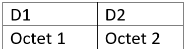
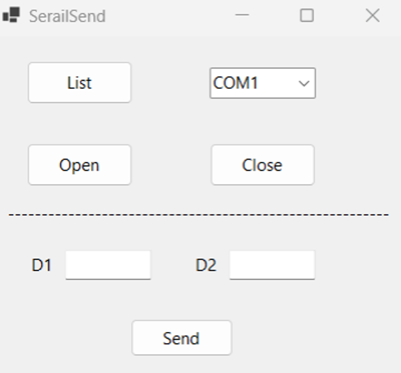
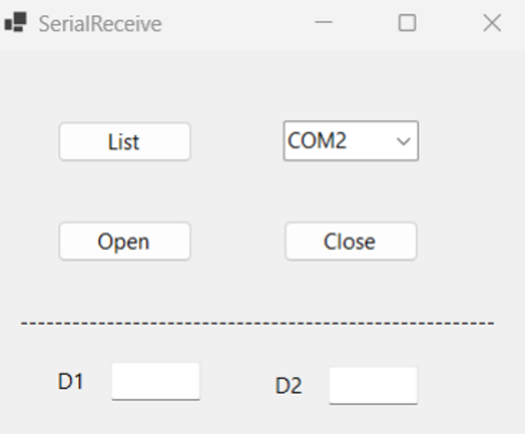

# Lab Communication série en C#

Ecrire le code C# pour envoyer et recevoir des données de détecteurs de mouvement par communication sérielle. 
Voici le protocole de communication pour l’envoi et la réception des données (D1 : Numéro du détecteur, D2 : Statut (0 – 1)): 

Les interfaces d’envoi et de réception sont les suivantes :

## Interface d’envoi (SerialSend)
 

## Interface de réception (SerialReceive)

 
